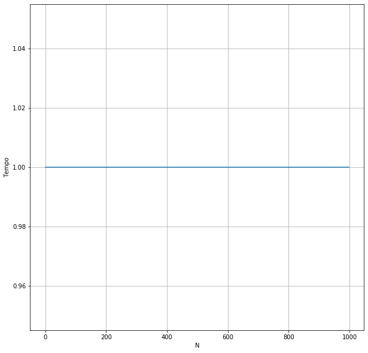
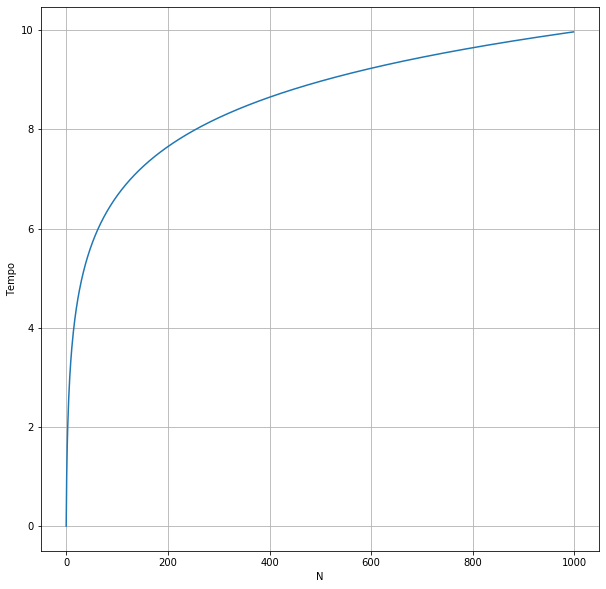
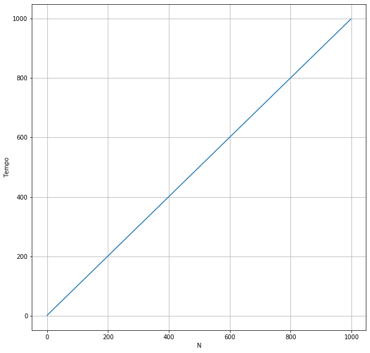
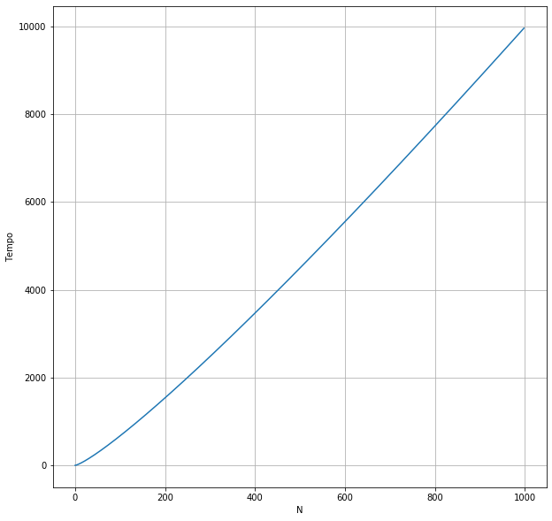
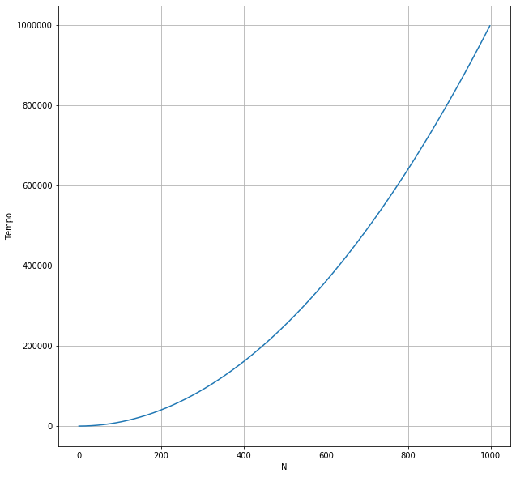
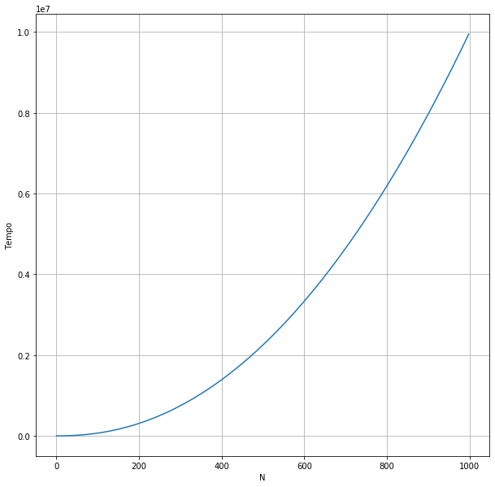
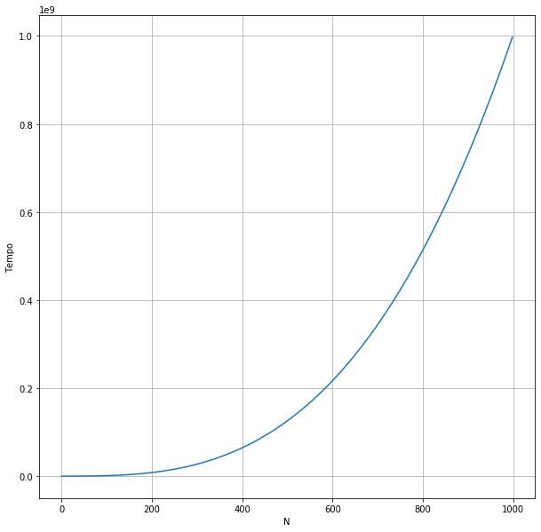
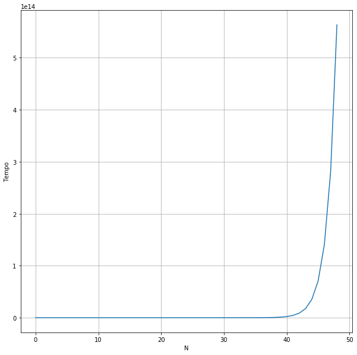

## Visualização do comportamento das funções de complexidade algorítmica

Este é um documento que busca facilitar a visualização dos diferentes comportamentos das funções que explicam diferentes complexidades algorítmicas.

Os algoritmos listados no documento, tem sua ordem de apresentação definida pela velocidade de crescimento da função frente a grandes conjuntos de dados, indo do crescimento mais lento ao crescimento mais rápido.


```python
import numpy as np
import matplotlib.pyplot as plt
```


```python
def plot_fnc(fnc, rng=(1, 1000)) -> None:
    plt.figure(figsize=(10, 10))
    plt.plot(fnc(np.arange(*rng)))
    
    plt.grid(True)
    plt.xlabel("N")
    plt.ylabel("Tempo")
    
    plt.show()
```

### 1. Θ(1)

* Função constante


```python
fnc = np.vectorize(lambda x: 1)
```


```python
plot_fnc(fnc)
```





### 2. Θ(lg n)

* Função logarítmica


```python
fnc = np.vectorize(lambda x: np.log2(x))
```


```python
plot_fnc(fnc)
```





### 3. Θ(n)

* Função linear


```python
fnc = np.vectorize(lambda x: x)
```


```python
plot_fnc(fnc)
```





### 4. Θ(n lg n)

* Função linearítmica/quasilinear


```python
fnc = np.vectorize(lambda x: x * np.log2(x))
```


```python
plot_fnc(fnc)
```





### 5. Θ(n²)

* Função polinomial (2° grau)


```python
fnc = np.vectorize(lambda x: x**2)
```


```python
plot_fnc(fnc)
```





### 6. Θ(n²  lg n)

* Função polinomial 


```python
fnc = np.vectorize(lambda x: (x**2) * np.log2(x))
```


```python
plot_fnc(fnc)
```





### 8. Θ(n³)

* Função polinomial (3° grau)


```python
fnc = np.vectorize(lambda x: x ** 3)
```


```python
plot_fnc(fnc)
```





### 9. Θ$(2^{n})$

* Função exponencial


```python
fnc = np.vectorize(lambda x: 2 ** x)
```


```python
plot_fnc(fnc, rng=(1, 50))
```




